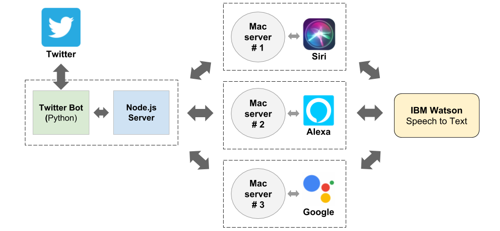

# Twitter Assistants

**Twitter Assistants** is a twitter bot that lets you ask questions to Siri, Alexa, and Google Assistant at the same time. You could tweet a question to *@Assistants_MH*, your question is sent to each of the assistants, and then they send back a reply to your tweet.

We have a Python twitter bot running that periodically checks Twitter to see if there are any new tweets to the *Assistants account*. If it finds a new tweet, it gets passed to a Node.js server that coordinates the three voice assistants. When the server receives a new tweet, it forwards the question to three Mac servers that interface with an assistant simultaneously. Each Mac spawns an instance of their voice assistant and speaks the question using Text to Speech (specifically, the macOS *say* command piped through a digital audio input). Siri is spawned by launching the built-in macOS *Siri.app*, Alexa is spawned using a sample app from the *[Alexa Voice Assistant (AVS)](https://github.com/alexa/avs-device-sdk)* device SDK, and Google Assistant is spawned using a sample app from the [Google Assistant SDK](https://github.com/googlesamples/assistant-sdk-python/tree/master/google-assistant-sdk#googlesamples-assistant-pushtotalk). 

After the question is spoken to the assistant and they start speaking an answer, their response is recorded to a file on disk. Once they finish speaking, the recording is uploaded to IBM Watson's Speech to Text API. The final text answer from Watson is then sent back to the Node.js server, which in turn uses the Twitter bot to post the answer a reply to the original tweet.

There's a lot of pieces in play here, so this diagram can help make some sense out of it all:

  

We really struggled to get this working in 19 hours (more like 13 hours when you include sleep). We had a good bit of domain knowledge from building Siri Query, but we were still very low on time. We had to set up a pretty fragile audio piping scheme using an app called Loopback, and the assistants were kinda flaky, so the chance of something breaking on any given run was pretty high. We did have a few flawless runs, though, which were super cool to watch.

